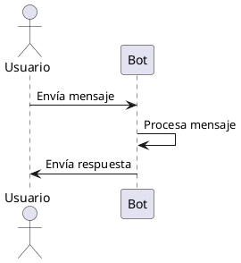

# 📚 Documentación del Proyecto JIC-VentiBot

## 📋 Índice
1. [Introducción](#introducción)
2. [Arquitectura del Sistema](#arquitectura-del-sistema)
3. [Tecnologías Utilizadas](#tecnologías-utilizadas)
4. [Estructura del Proyecto](#estructura-del-proyecto)
5. [Módulos Principales](#módulos-principales)
6. [Flujo de Funcionamiento](#flujo-de-funcionamiento)
7. [Integración con WhatsApp](#integración-con-whatsapp)
8. [Integración con IA](#integración-con-ia)
9. [Base de Datos](#base-de-datos)
10. [Sistema de Estabilidad](#sistema-de-estabilidad)
11. [Interfaz Web y Panel de Administración](#interfaz-web-y-panel-de-administración)
12. [Despliegue](#despliegue)
13. [Configuración del Entorno](#configuración-del-entorno)

---

## 📝 Introducción

**JIC-VentiBot** es un asistente virtual desarrollado para ElectronicsJS, una tienda especializada en laptops y accesorios. Este bot fue creado como parte de un proyecto para la Jornada de Iniciación Científica y está diseñado para proporcionar atención automatizada a través de WhatsApp a los clientes de la tienda.

El bot ofrece capacidades de respuesta inteligente a consultas sobre productos, horarios, información de la empresa y más, utilizando inteligencia artificial (Google Gemini AI) para generar respuestas contextuales y precisas. También incluye un sistema de monitoreo y estabilidad para garantizar el funcionamiento continuo del servicio.

---

## 🏗️ Arquitectura del Sistema

La arquitectura del sistema se basa en un diseño modular con los siguientes componentes:

1. **Cliente WhatsApp**: Interfaz para comunicarse con la API de WhatsApp Web.
2. **Procesador de Mensajes**: Sistema de gestión de mensajes entrantes y salientes.
3. **Motor de IA**: Integración con Google Gemini AI para generar respuestas.
4. **Base de Datos**: Almacenamiento de productos, categorías y otra información relevante usando Supabase.
5. **Sistema de Estabilidad**: Monitoreo y mantenimiento de la conexión.
6. **Interfaz Web**: Panel de control para ver el estado del bot y escanear el código QR para la autenticación.

El sistema sigue un patrón de arquitectura orientada a eventos, donde los mensajes entrantes desencadenan procesos específicos que culminan en respuestas automatizadas.

---

## 💻 Tecnologías Utilizadas

### Lenguajes y Runtime
- **Node.js**: Entorno de ejecución para JavaScript del lado del servidor.
- **JavaScript**: Lenguaje principal de programación.

### Bibliotecas y Frameworks
- **whatsapp-web.js**: Para la integración con WhatsApp Web.
- **express**: Framework web para crear la API REST y servir la interfaz web.
- **socket.io**: Para comunicación en tiempo real entre servidor y cliente web.
- **@google/generative-ai**: Cliente de API para Google Gemini AI.
- **@supabase/supabase-js**: Cliente para interactuar con la base de datos Supabase.
- **axios**: Cliente HTTP para realizar solicitudes.
- **moment-timezone**: Para manejo de fechas, horas y zonas horarias.
- **qrcode**: Para generar códigos QR para la autenticación de WhatsApp.
- **dotenv**: Para manejar variables de entorno.
- **pg**: Cliente PostgreSQL.

### Herramientas de Despliegue
- **PM2**: Gestor de procesos para aplicaciones Node.js en producción.
- **Docker**: Para contenedorización (indicado por el Dockerfile).
- **Render**: Plataforma de despliegue en la nube (según configuración en render.yaml).

---

## 📂 Estructura del Proyecto

```
/
├── bot/                         # Directorio principal del bot
│   ├── app.js                   # Punto de entrada principal
│   ├── info_empresa.txt         # Información sobre la empresa
│   ├── promt.txt                # Instrucciones para el asistente virtual
│   ├── promt_etapa1.txt         # Instrucciones adicionales (etapa 1)
│   ├── verificar-categorias.js  # Herramienta de gestión de categorías
│   │
│   ├── modulos/                 # Módulos del sistema
│   │   ├── cliente-whatsapp.js  # Gestión del cliente WhatsApp
│   │   ├── conexion.js          # Configuración de conexión a base de datos
│   │   ├── constantes.js        # Constantes del sistema
│   │   ├── mensajes-sistema.js  # Plantillas de mensajes
│   │   ├── procesador-mensajes.js # Lógica de procesamiento de mensajes
│   │   ├── respuestas-ia.js     # Integración con IA y generación de respuestas
│   │   ├── rutas.js             # Definición de rutas del servidor web
│   │   ├── stability-manager.js # Sistema de estabilidad y monitoreo
│   │   └── utilidades.js        # Funciones utilitarias
│   │
│   └── web/                     # Interfaz web
│       └── index.html           # Página para escanear código QR
│
├── ecosystem.config.js          # Configuración para PM2
├── package.json                 # Dependencias del proyecto
├── render.yaml                  # Configuración para despliegue en Render
├── Dockerfile                   # Configuración para Docker
└── script_completo.sql          # Script SQL para configuración de base de datos
```

---

## 🧩 Módulos Principales

### 1. Cliente WhatsApp (`cliente-whatsapp.js`)
Este módulo es responsable de la inicialización y configuración del cliente de WhatsApp utilizando la biblioteca whatsapp-web.js. Maneja eventos como la generación de códigos QR, la conexión exitosa y la recepción de mensajes.

**Características principales:**
- Configuración optimizada de Puppeteer para entornos de producción
- Manejo de eventos de WhatsApp (QR, ready, message, etc.)
- Integración con Socket.IO para transmitir información al frontend

### 2. Procesador de Mensajes (`procesador-mensajes.js`)
Este módulo procesa todos los mensajes entrantes, determina el tipo de consulta y coordina la generación de respuestas.

**Características principales:**
- Sistema de cola para mensajes entrantes
- Detección de spam y mensajes repetidos
- Manejo de solicitudes de atención humana
- Procesamiento de mensajes con medios (imágenes, documentos, etc.)
- Límites de tasa para prevenir abusos

### 3. Respuestas IA (`respuestas-ia.js`)
Integra con Google Gemini AI para generar respuestas contextuales a las consultas de los usuarios.

**Características principales:**
- Selección inteligente de datos relevantes según la consulta
- Consultas a la base de datos para obtener información de productos
- Búsqueda de productos específicos según criterios
- Generación de respuestas con contexto de conversación

### 4. Administrador de Estabilidad (`stability-manager.js`)
Sistema completo para mantener la estabilidad y disponibilidad del bot.

**Características principales:**
- Keep-Alive automático con reintentos
- Monitoreo de memoria y recursos
- Manejo de eventos de desconexión y reconexión
- Sistema de verificación de salud periódica
- Limpieza de sesiones y reinicio automático

### 5. Utilidades (`utilidades.js`)
Colección de funciones de utilidad para diversas tareas.

**Características principales:**
- Verificación de horarios de la tienda
- Detección de spam y mensajes repetidos
- Gestión de contexto de conversaciones
- Control de límites de mensajes

---

## 🔄 Flujo de Funcionamiento

1. **Inicialización**:
   - El servidor Express arranca y configura las rutas
   - Se inicializa el cliente de WhatsApp y el sistema de estabilidad
   - Se establece la conexión con WhatsApp Web mediante código QR

2. **Recepción de Mensajes**:
   - Los mensajes entrantes se encolan para procesamiento
   - Se verifica si el mensaje es spam o si excede los límites de tasa
   - Se determina si contiene medios (imágenes, documentos, etc.)

3. **Procesamiento**:
   - Se verifica si la tienda está abierta
   - Se identifica el tipo de consulta (horarios, productos, atención humana, etc.)
   - Se determina el conjunto de datos relevante para la consulta

4. **Generación de Respuestas**:
   - Para consultas simples, se utilizan plantillas predefinidas
   - Para consultas complejas, se consulta la base de datos y se genera una respuesta con IA
   - Se mantiene contexto de la conversación para respuestas coherentes

5. **Envío de Respuesta**:
   - Se envía la respuesta al usuario a través de WhatsApp
   - Se actualiza el contexto de la conversación
   - Se registra la interacción para estadísticas

---

# 🔄 Flujo Básico de Respuesta a un Mensaje

El flujo más simple para responder un mensaje en el bot es el siguiente:



1. El usuario envía un mensaje por WhatsApp.
2. El bot procesa el mensaje recibido.
3. El bot responde al usuario.

Este es el flujo esencial y más básico de funcionamiento del bot para responder mensajes.

---

## 📱 Integración con WhatsApp

La integración con WhatsApp se realiza mediante la biblioteca whatsapp-web.js, que permite:

- **Autenticación**: Mediante código QR mostrado en la interfaz web
- **Envío y recepción de mensajes**: Manejo de texto y diferentes tipos de medios
- **Gestión de sesiones**: Mantenimiento y recuperación automática de sesiones
- **Manejo de eventos**: Desconexiones, reconexiones, errores, etc.

El sistema incluye configuraciones optimizadas para Puppeteer que minimizan el uso de recursos y maximizan la estabilidad, especialmente importante para despliegues en entornos con recursos limitados.

---

## 🧠 Integración con IA

El bot utiliza Google Gemini AI a través de la biblioteca oficial @google/generative-ai para generar respuestas contextuales y naturales.

**Proceso de generación de respuestas**:
1. **Análisis de la consulta**: Determina si la consulta se relaciona con productos, información de la empresa, etc.
2. **Recopilación de datos**: Consulta la base de datos para obtener información relevante
3. **Construcción del contexto**: Combina el historial de conversación, datos relevantes y la consulta actual
4. **Generación de la respuesta**: Utiliza IA para generar una respuesta natural y coherente
5. **Validación y entrega**: Verifica que la respuesta sea apropiada y la envía al usuario

La configuración de la IA utiliza prompts específicos (contenidos en `promt.txt` y `promt_etapa1.txt`) que definen el comportamiento, tono y límites del asistente virtual.

---

## 🗄️ Base de Datos

El proyecto utiliza Supabase como plataforma de base de datos, con PostgreSQL como motor subyacente.

**Estructura principal**:
- **Productos**: Información detallada sobre productos disponibles
- **Categorías**: Clasificación de productos (laptops gamer, gama alta, etc.)
- **Vistas**: Vistas optimizadas para consultas frecuentes
- **Funciones**: Funciones SQL para operaciones complejas como búsqueda de productos

La integración se realiza mediante el cliente oficial @supabase/supabase-js, y el archivo `script_completo.sql` contiene la definición completa del esquema.

---

## 🛡️ Sistema de Estabilidad

Uno de los componentes más importantes del proyecto es el sistema de estabilidad, que garantiza el funcionamiento continuo del bot incluso en condiciones adversas.

**Características principales**:
- **Monitoreo de salud**: Verificación periódica del estado del sistema
- **Keep-Alive**: Ping regular al servidor para mantenerlo activo
- **Reconexión inteligente**: Sistema con retroceso exponencial para reconexiones
- **Gestión de memoria**: Monitoreo de uso de memoria para prevenir fugas
- **Manejo de despliegues**: Detección y manejo de actualizaciones del servidor
- **Reinicio automático**: Recuperación automática tras fallos críticos
- **API de salud**: Endpoint para monitorear el estado del sistema

Este sistema hace que el bot sea altamente resiliente, capaz de recuperarse automáticamente de la mayoría de los fallos sin intervención manual.

---

## 🖥️ Interfaz Web y Panel de Administración

El proyecto incluye una interfaz web moderna y un panel de administración, diseñados para:
- Mostrar el código QR para la autenticación inicial de WhatsApp
- Proporcionar información del estado de la conexión
- Permitir la recarga manual del código QR si es necesario
- **Panel de Administración:** Monitoreo en tiempo real, configuración de parámetros y visualización de métricas operacionales
- **Interfaz de Administración:** Panel web desarrollado en HTML/CSS/JavaScript para monitoreo en tiempo real, configuración de parámetros y visualización de métricas operacionales. En la misma web donde se muestra el código QR, también se despliegan algunas métricas clave del sistema (como estado de la conexión, memoria utilizada, actividad reciente, etc.) para facilitar la supervisión y gestión del bot desde cualquier dispositivo.

La interfaz está desarrollada en HTML, CSS y JavaScript, utilizando Socket.IO para actualización en tiempo real. El panel de administración permite a los operadores:
- Visualizar métricas clave del sistema (estado, memoria, actividad reciente)
- Modificar parámetros de configuración sin reiniciar el bot
- Monitorear logs y eventos importantes en tiempo real
- Acceder a herramientas de diagnóstico y endpoints de salud

El diseño es responsivo y enfocado en la usabilidad, facilitando la gestión y supervisión del bot desde cualquier dispositivo.

---

## 🚀 Despliegue

El proyecto está configurado para ser desplegado en múltiples entornos:

1. **Render**: Configuración en `render.yaml`
2. **Docker**: Configuración en `Dockerfile`
3. **PM2**: Configuración en `ecosystem.config.js`

**Consideraciones importantes**:
- Configuración para optimizar el uso de memoria (512 MB máximo)
- Configuración para entornos sin GUI para Puppeteer
- Manejo de certificados y seguridad
- Estrategia de reintentos y recuperación automática

---

## ⚙️ Configuración del Entorno

### Variables de Entorno Requeridas:
- `GEMINI_API_KEY`: Clave de API para Google Gemini
- `SUPABASE_URL`: URL de la instancia de Supabase
- `SUPABASE_ANON_KEY`: Clave anónima de Supabase
- `APP_URL`: URL de la aplicación desplegada (para keep-alive)
- `PORT`: Puerto para el servidor web (opcional, predeterminado 3000)

### Iniciar en Desarrollo:
```bash
npm install
npm run dev
```

### Iniciar en Producción:
```bash
npm install
npm start
# O usando PM2
pm2 start ecosystem.config.js
```

---

## 🔑 Capacidades Clave del Bot

1. **Respuestas Contextuales**: Capacidad de mantener contexto en conversaciones
2. **Búsqueda de Productos**: Consultas naturales sobre productos disponibles
3. **Filtrado Avanzado**: Búsqueda por categoría, rango de precios, etc.
4. **Detección de Horarios**: Respuestas adaptadas según el horario de la tienda
5. **Transferencia a Humanos**: Capacidad de detectar cuando se requiere atención humana
6. **Resistencia a Fallos**: Sistema de recuperación automática ante diversos problemas
7. **Detección de Abuso**: Sistemas para prevenir spam y uso excesivo

---

## 📊 Rendimiento y Escalabilidad

El sistema está diseñado para optimizar el uso de recursos y escalar adecuadamente:
- Utiliza una cola de mensajes para gestionar altos volúmenes
- Implementa límites de tasa para prevenir abusos
- Monitorea el uso de memoria y recursos
- Utiliza cachés para información frecuentemente consultada
- Implementa patrones de retroceso exponencial para reconexiones
- Cuenta con sistemas de limpieza periódica para prevenir fugas de memoria

---

## 🧪 Herramientas de Desarrollo y Prueba

El proyecto incluye herramientas para facilitar el desarrollo y pruebas:
- **verificar-categorias.js**: Script para auditar y reorganizar categorías de productos
- **Endpoints de diagnóstico**: `/health`, `/status`, `/ping` y `/gc`
- **Monitoreo en tiempo real**: Información detallada sobre el estado del sistema
- **Logs detallados**: Registro de eventos importantes para diagnóstico

---

*Documentación generada para JIC-VentiBot - Última actualización: Junio 2025*
